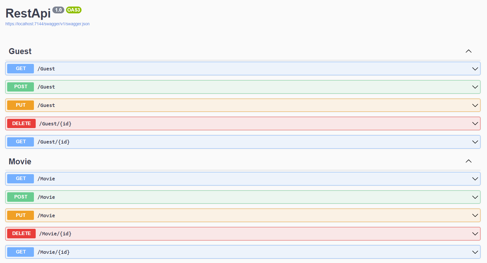

# API REST films

## Description du Projet

Cette API fournie des opérations CRUD pour la gestion de films et des personnalitées qui ont participées à sa création.
Les données sont sauvegardées dans un fichier DB SqLite en local sur la machine.

## Screenshot



## Prérequis

Avant de commencer, assurez-vous d'avoir les éléments suivants installés sur votre système :

- VS2022 : [Télécharger et Installer](https://visualstudio.microsoft.com/fr/downloads/)

## Installation

Clonez ce repository sur votre machine locale en utilisant la commande suivante :
```bash
git clone https://gitlab.com/TheoRamousse/tp3restapi.git
```

Ouvrir ensuite le projet C# sur VS2022 qui se trouve dans le dossier "RestApi".

Se rendre ensuite dans Outils > Gestionnaire de packages Nugets > Gérer les packages de la solution et installer :
- *Microsoft.EntityFrameworkCore.Sqlite* (en **version 7**) 
- *Microsoft.EntityFrameworkCore.Tools* (en **version 7**) 


Après cela rendez vous sur Outils > Gestionnaire de packages Nugets > Console.

Taper la commande :
```
Update-Database
```
Vous pouvez ensuite démarrer la solution.

Lac page du swagger apparaît sur laquelle vous pouvez tester l'intégralité des endpoints. Voici quelques données au format JSON que vous pouvez ajouter avec les méthodes POST : 

```json
{
    "firstname": "Jean",
    "lastname": "Dujardin",
    "birthdate": "2015-05-16T05:50:06"
}

{
    "firstname": "Sylvester",
    "lastname": "Stallone",
    "birthdate": "2015-05-16T05:50:06"
}

{
    "name": "Titanic",
    "releaseDate": "2015-05-29T05:50:00",
    "description": "C'est un film avec un bateau qui coule pendant 3 heures",
    "guests": [
        {
          "id": 1,
          "role": 1
        },
        {
          "id": 2,
          "role": 0
        }
    ]
}
```

## Auteur

Théo RAMOUSSE